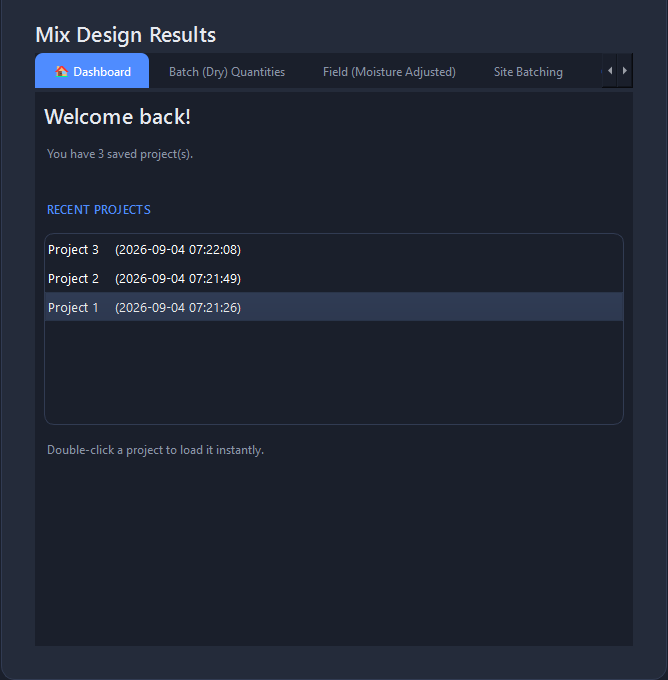
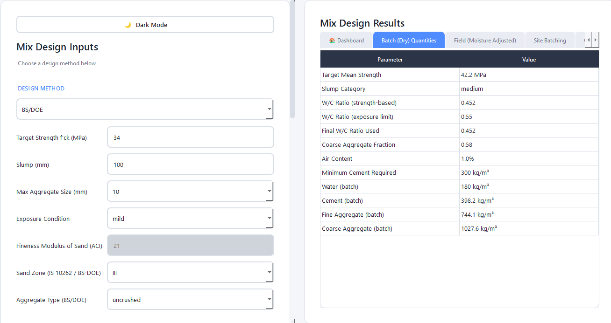
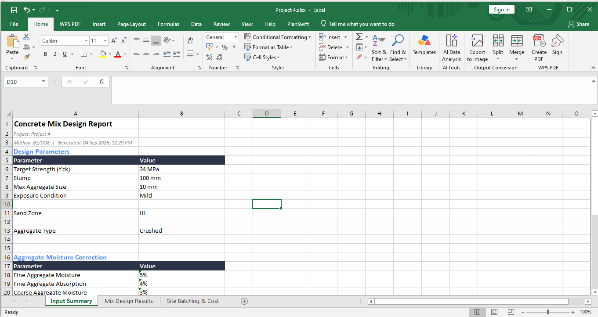

# Concrete Mix Design

A desktop application for civil engineers to design concrete mixes using **ACI 211.1**, **IS 10262:2019**, or **BS/DOE** standard methods. Built with PySide6 (Qt), it takes basic design parameters and produces complete, ready-to-use mix design quantities — corrected for real site conditions, along with cost estimates and professional PDF/Excel reports.


## Table of Contents

- [Overview](#overview)
- [Features](#features)
- [Screenshots](#screenshots)
- [Download](#download)
- [Running from Source](#running-from-source)
- [Building the Executable](#building-the-executable)
- [Building the Installer](#building-the-installer)
- [How It Works](#how-it-works)
- [Project Structure](#project-structure)
- [Tech Stack](#tech-stack)
- [Method Reference](#method-reference)
- [License](#license)

## Overview

Designing a concrete mix by hand means flipping through code tables, interpolating values, and manually correcting for moisture, exposure conditions, and site batching — a process that's easy to get wrong and tedious to repeat for every trial. This application automates that entire workflow: enter the design parameters once, and get lab (dry) quantities, site (moisture-corrected) quantities, batching instructions, cost estimates, and shareable reports — all validated against standard mix design tables from three major international standards.

It's built for civil engineering students, site engineers, and lab technicians who need quick, repeatable, and accurate mix designs without relying on spreadsheets or manual lookups.

## Features

### Design & Calculation

- **Three Design Standards** — choose between ACI 211.1 (US), IS 10262:2019 (Indian), and BS/DOE (British) from a single dropdown
  - ACI uses fineness modulus for sand classification
  - IS 10262 uses sand zoning (Zone I–IV, per IS 383) and enforces minimum cement content
  - BS/DOE uses a density-based (mass-basis) approach with a strength-to-water/cement ratio curve, accounting for aggregate shape (crushed vs uncrushed)
- **Durability-Aware Design** — exposure conditions (mild, moderate, severe, very severe, extreme) automatically apply the correct maximum w/c ratio, minimum air content, and minimum cement content for the selected standard
- **Aggregate Moisture Correction** — converts lab (dry) batch quantities into real site (field) quantities based on measured moisture and absorption of both fine and coarse aggregate
- **Trial Mix Adjustment** — recalculates water and cement content based on the actual slump measured from a site trial batch, correcting for the difference from the target

### Site & Cost Tools

- **Site Batching** — converts the per-m³ design into cement bags per m³ and total material quantities for any project volume
- **Cost Estimation** — computes total project cost and cost-per-m³ from user-supplied material rates

### Data & Reporting

- **Save, Search, and Reload Projects** — every mix design can be saved locally (SQLite-backed), searched by name, reloaded, or deleted
- **Dashboard** — a landing tab showing total saved project count and the 5 most recent designs, ready to reload with a double-click
- **PDF Reports** — structured input summary, complete result tables (batch, field, site batching, cost), trial mix section, and all charts embedded
- **Excel Reports** — the same structured data exported as a multi-sheet workbook, ready for further analysis in a spreadsheet

### Visualization

- **Interactive Charts** — mix composition (pie), cost breakdown (bar), batch-vs-field comparison, and w/c ratio comparison, shown one at a time in a large view
- **Chart Navigation & Zoom** — switch between charts with navigation buttons, scroll to zoom in for detail, and reset to the default view with one click

### Interface

- **Light & Dark Themes** — switch between a dark and light interface with a single toggle button
- **Contextual Help** — every input field includes a hover tooltip explaining what it means and how it's typically determined
- **Splash Screen & Loading States** — a startup splash screen and visual feedback while calculating or generating reports
- **Custom App Icon & Installer** — a dedicated application icon and a proper Windows installer with Desktop/Start Menu shortcuts and an uninstaller

## Screenshots

| Dashboard | Charts |
|---|---|
|  |  |

| Light Theme | Main Window |
|---|---|
|  |  |

| PDF Report | Excel Report |
|---|---|
|  |  |

## Download

Pre-built Windows installer is available on the [Releases](../../releases) page — no Python installation required.

1. Download `ConcreteMixDesignSetup.exe` from the latest release
2. Run it and follow the setup wizard
3. Launch from the Desktop shortcut or Start Menu

The installer also registers an uninstaller, accessible from Windows' "Apps & Features" / Control Panel.

## Running from Source

**Requirements:** Python 3.10+

```bash
git clone https://github.com/fahadkhan-91/concrete-mix-design-app.git
cd concrete-mix-design-app
pip install -r requirements.txt
python app.py
```

## Building the Executable

The app is packaged into a standalone Windows executable using PyInstaller:

```bash
python -m PyInstaller --name="ConcreteMixDesign" --windowed --onefile --icon=app_icon.ico --hidden-import=logic.mix_design --hidden-import=logic.is10262 --hidden-import=logic.bs_doe --collect-all=numpy app.py
```

The executable is created in the `dist/` folder and requires no Python installation to run.

## Building the Installer

The Windows installer is built with [Inno Setup](https://jrsoftware.org/isinfo.php) using the `ConcreteMixDesign.iss` script included in this repository:

1. Build the executable first (see above)
2. Open `ConcreteMixDesign.iss` in Inno Setup Compiler
3. Build → Compile

The installer is created in the `Output/` folder.

## How It Works

1. **Inputs** — target strength, slump, max aggregate size, exposure condition, and (depending on the standard) fineness modulus, sand zone, or aggregate type
2. **Water content** is looked up from the selected standard's table and adjusted for slump and aggregate shape
3. **Water-cement ratio** is chosen as the stricter of the strength-based value and the exposure durability limit
4. **Cement content** is derived from water ÷ w/c ratio, checked against minimum cement requirements
5. **Aggregate proportions** are calculated per the selected standard's method — volume-based (ACI, IS) or density/mass-based (BS/DOE)
6. **Moisture correction** converts these lab quantities into real field quantities based on user-supplied aggregate moisture and absorption values
7. **Batching, cost, and reporting** layers all build on top of this core result

## Project Structure

- `app.py` — Main PySide6 application (UI + orchestration)
- `logic/`
  - `mix_design.py` — ACI 211.1 calculation engine
  - `is10262.py` — IS 10262:2019 calculation engine
  - `bs_doe.py` — BS/DOE calculation engine
- `database.py` — SQLite save/load/search/delete for projects
- `charts_widget.py` — Matplotlib chart widgets
- `report_generator.py` — PDF report generation (ReportLab)
- `excel_exporter.py` — Excel report generation (openpyxl)
- `app_icon.ico` — Application icon
- `ConcreteMixDesign.iss` — Inno Setup installer script
- `requirements.txt`

## Tech Stack

- **PySide6** — desktop GUI framework
- **SQLite** — local project storage
- **Matplotlib** — chart rendering
- **ReportLab** — PDF report generation
- **openpyxl** — Excel report generation
- **PyInstaller** — standalone executable packaging
- **Inno Setup** — Windows installer creation

## Method Reference

Mix design calculations are based on:
- **ACI 211.1** — Standard Practice for Selecting Proportions for Normal, Heavyweight, and Mass Concrete
- **IS 10262:2019** — Concrete Mix Proportioning — Guidelines (with durability requirements from IS 456)
- **BS/DOE** — British "Design of Normal Concrete Mixes" (Department of Environment) method

These implementations follow the standard tables and procedures for design guidance. Actual site trial mixes with tested materials are recommended before full-scale production, as noted in the generated reports.

## License

This project is licensed under the MIT License — see the [LICENSE](LICENSE) file for details.
