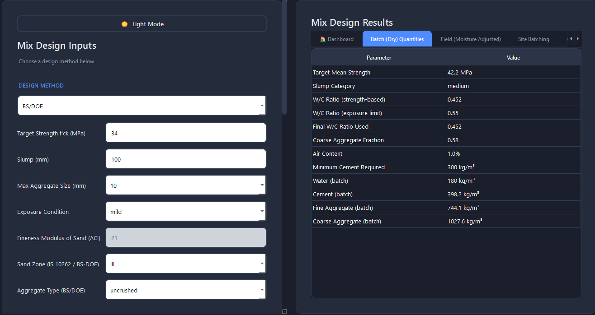
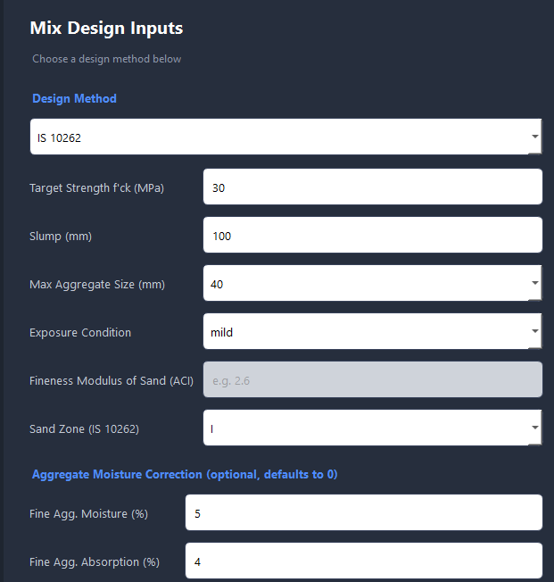
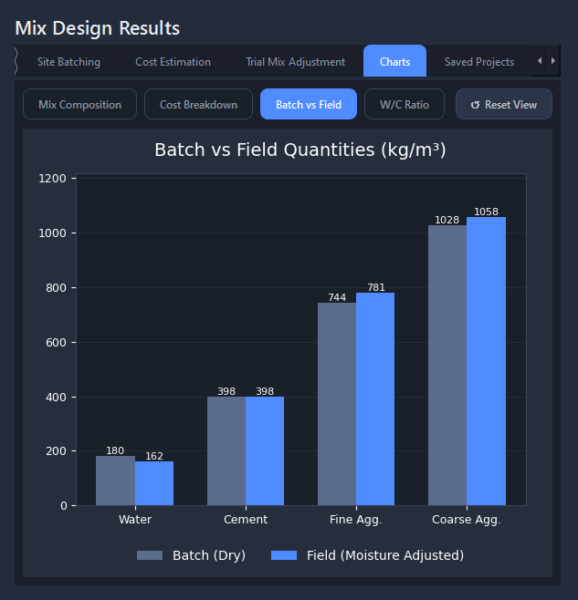
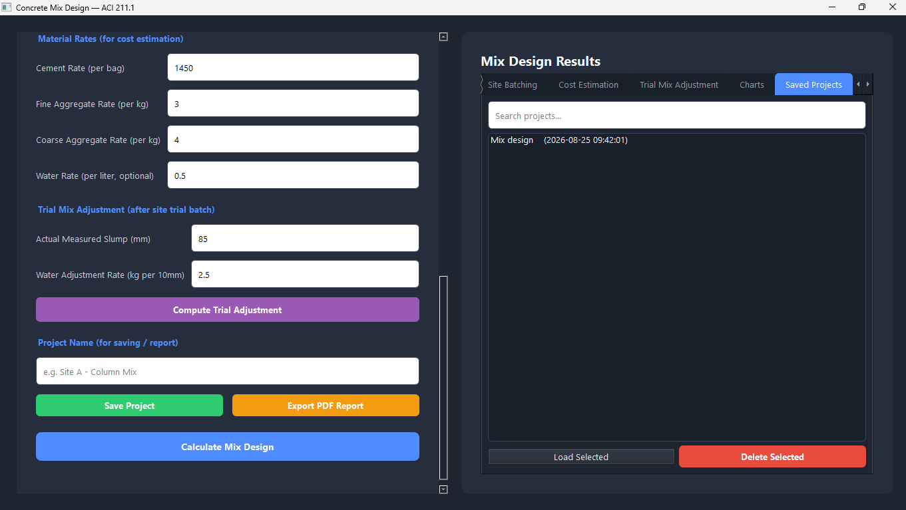
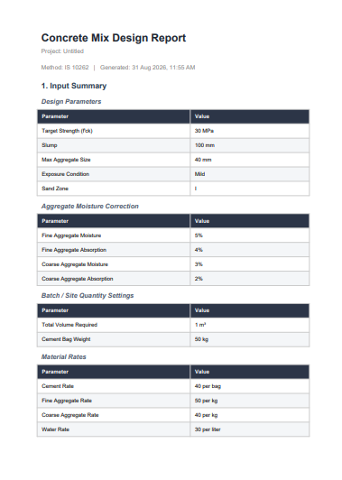

# Concrete Mix Design

A desktop application for civil engineers to design concrete mixes using **ACI 211.1** or **IS 10262:2019** standard methods. Built with PySide6 (Qt), it takes basic design parameters and produces complete, ready-to-use mix design quantities — corrected for real site conditions, along with cost estimates and professional PDF reports.



## Table of Contents

- [Overview](#overview)
- [Features](#features)
- [Screenshots](#screenshots)
- [Download](#download)
- [Running from Source](#running-from-source)
- [Building the Executable](#building-the-executable)
- [Building the Installer](#building-the-installer)
- [How It Works](#how-it-works)
- [Project Structure](#project-structure)
- [Tech Stack](#tech-stack)
- [Method Reference](#method-reference)
- [Roadmap](#roadmap)
- [License](#license)

## Overview

Designing a concrete mix by hand means flipping through code tables, interpolating values, and manually correcting for moisture, exposure conditions, and site batching — a process that's easy to get wrong and tedious to repeat for every trial. This application automates that entire workflow: enter the design parameters once, and get lab (dry) quantities, site (moisture-corrected) quantities, batching instructions, cost estimates, and a shareable PDF report — all validated against standard mix design tables.

It's built for civil engineering students, site engineers, and lab technicians who need quick, repeatable, and accurate mix designs without relying on spreadsheets or manual lookups.

## Features

### Two Design Standards
Choose between **ACI 211.1** (US) and **IS 10262:2019** (Indian) mix design methods from a single dropdown. Each method uses its own tables for water content, water-cement ratio, and aggregate proportioning — ACI uses fineness modulus for sand classification, while IS uses sand zoning (Zone I–IV) as per IS 383.

### Durability-Aware Design
Exposure conditions (mild, moderate, severe, very severe, extreme) automatically apply the correct durability limits — maximum permissible water-cement ratio, minimum air content, and (for IS 10262) minimum cement content — rather than leaving these as separate manual checks.

### Real Site Correction
Lab-calculated (dry/batch) quantities rarely match what you actually need on site, because aggregates carry moisture. Enter the measured moisture and absorption of your fine and coarse aggregate, and the app computes the corrected field quantities and adjusted water content automatically.

### Site Batching
Converts the per-m³ mix design into practical batching numbers — cement bags required per m³, and total material quantities for whatever volume of concrete you're actually pouring.

### Cost Estimation
Enter your local material rates (per bag of cement, per kg of aggregate, per liter of water) and get an instant total project cost and cost-per-m³ breakdown.

### Trial Mix Adjustment
After casting a trial batch on site, if the measured slump doesn't match the target, this feature recalculates the water and cement content needed to correct it — based on the actual measured slump rather than the theoretical design value.

### Charts & Visualization
Four charts give an at-a-glance view of the mix: composition by weight (pie), cost breakdown (bar), batch-vs-field quantity comparison, and a water-cement ratio comparison across strength-based, exposure-limited, and final values.

### Save, Search, and Reload Projects
Every mix design can be saved locally (SQLite-backed) under a project name, searched later, reloaded to view or edit again, or deleted — useful for keeping a record of designs across multiple sites or trial batches.

### Structured PDF Reports
Generates a complete, multi-page PDF report: a structured input summary, full result tables (batch, field, site batching, cost), the trial mix adjustment (if computed), and all four charts — ready to print, email, or file for records.

## Screenshots

| Design Method Selector | Charts |
|---|---|
|  |  |

| Saved Projects | PDF Report |
|---|---|
|  |  |

## Download

Pre-built Windows installer is available on the [Releases](../../releases) page — no Python installation required.

1. Download `ConcreteMixDesignSetup.exe` from the latest release
2. Run it and follow the setup wizard
3. Launch from the Desktop shortcut or Start Menu

The installer also registers an uninstaller, accessible from Windows' "Apps & Features" / Control Panel.

## Running from Source

**Requirements:** Python 3.10+

```bash
git clone https://github.com/fahadkhan-91/concrete-mix-design-app.git
cd concrete-mix-design-app
pip install -r requirements.txt
python app.py
```

## Building the Executable

The app is packaged into a standalone Windows executable using PyInstaller:

```bash
python -m PyInstaller --name="ConcreteMixDesign" --windowed --onefile --icon=app_icon.ico --hidden-import=logic.mix_design --hidden-import=logic.is10262 --collect-all=numpy app.py
```

The executable is created in the `dist/` folder and requires no Python installation to run.

## Building the Installer

The Windows installer is built with [Inno Setup](https://jrsoftware.org/isinfo.php) using the `ConcreteMixDesign.iss` script included in this repository:

1. Build the executable first (see above)
2. Open `ConcreteMixDesign.iss` in Inno Setup Compiler
3. Build → Compile

The installer is created in the `Output/` folder.

## How It Works

1. **Inputs** — target strength, slump, max aggregate size, exposure condition, and either fineness modulus (ACI) or sand zone (IS 10262)
2. **Water content** is looked up from the selected standard's table and interpolated/adjusted for slump
3. **Water-cement ratio** is chosen as the stricter of the strength-based value and the exposure durability limit
4. **Cement content** is derived from water ÷ w/c ratio (and checked against minimum cement requirements for IS 10262)
5. **Aggregate proportions** are calculated from the standard's coarse aggregate volume tables, with the remainder allocated to fine aggregate
6. **Moisture correction** converts these lab quantities into real field quantities based on user-supplied aggregate moisture and absorption values
7. **Batching, cost, and reporting** layers all build on top of this core result

## Project Structure

\`\`\`
concrete-mix-design-app/
├── app.py                  # Main PySide6 application (UI + orchestration)
├── logic/
│   ├── mix_design.py       # ACI 211.1 calculation engine
│   └── is10262.py          # IS 10262:2019 calculation engine
├── database.py              # SQLite save/load/search/delete for projects
├── charts_widget.py         # Matplotlib chart widgets
├── report_generator.py      # PDF report generation (ReportLab)
├── app_icon.ico              # Application icon
├── ConcreteMixDesign.iss     # Inno Setup installer script
└── requirements.txt
\`\`\`


## Tech Stack

- **PySide6** — desktop GUI framework
- **SQLite** — local project storage
- **Matplotlib** — chart rendering
- **ReportLab** — PDF report generation
- **PyInstaller** — standalone executable packaging
- **Inno Setup** — Windows installer creation

## Method Reference

Mix design calculations are based on:
- **ACI 211.1** — Standard Practice for Selecting Proportions for Normal, Heavyweight, and Mass Concrete
- **IS 10262:2019** — Concrete Mix Proportioning — Guidelines (with durability requirements from IS 456)

These implementations follow the standard tables and procedures for design guidance. Actual site trial mixes with tested materials are recommended before full-scale production, as noted in the generated PDF reports.

## Roadmap

Planned for future versions:
- Additional design standards (e.g. BS/DOE)
- Batch history/version comparison for a single project
- Export to Excel/CSV alongside PDF

## License

This project is licensed under the MIT License — see the [LICENSE](LICENSE) file for details.
